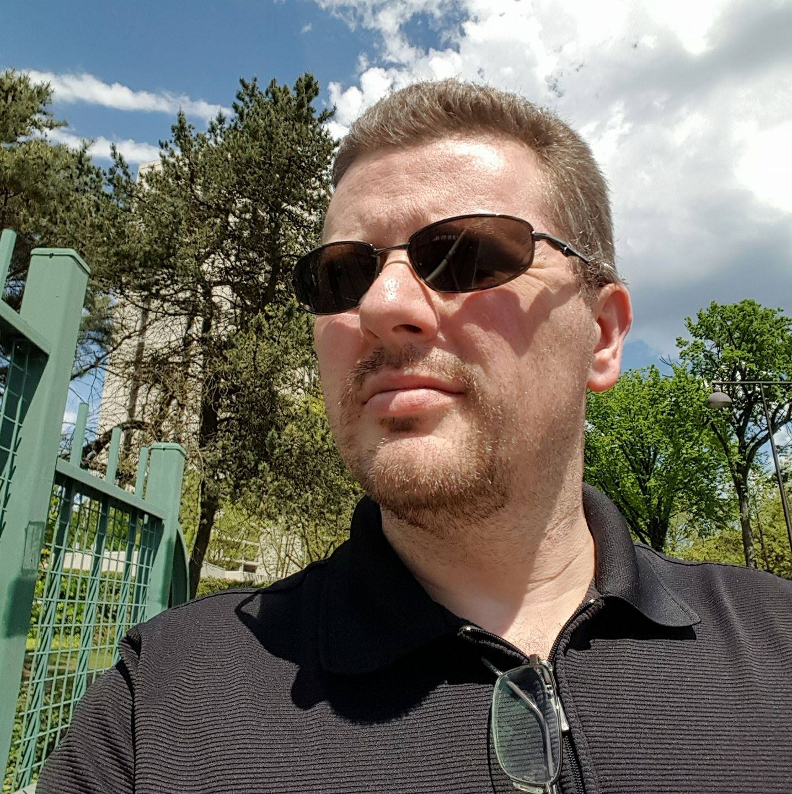

Welcome! My name is Jamie Nordmeyer. I’m a Software Engineer and Architect living and working in the Portland, OR Metro area. I was born in Redding,
CA, but have lived in the Pacific Northwest for most of my life, and absolutely love it here! I’m one of those bizarre types that, while I enjoy
the summer, definitely prefer the fall weather when the rain returns, and it’s cool outside. The term for someone like me is a Pluviophile, and I’m
happy to own it.

My core expertise is as a full-stack Microsoft developer on the Windows platform. I’ve worked with .NET since it’s initial release back in 2001,
and have written apps and services professionally in this environment since. I’ve also been a professional web developer nearly as long, and love the
dynamic nature of this field. Having worked with “vanilla” JavaScript, I’ve also used and taught sessions on jQuery, and have worked with
Angular, React, and Vue.

I also hold active **AWS Solutions Architect – Associate** and **AWS Developer - Asscoiate** certifications. You can view my certifications
by going [here](/my-certifications/).

In my personal life, I’m a husband, a father, and a very happy dog owner. I love working out, playing story-driven video games (Assassin’s Creed,
God of War, Ghost of Tsushima/Yotei, etc.), watching the occasional movie, reading, and constant learning. I’m always trying to pick up something new.
